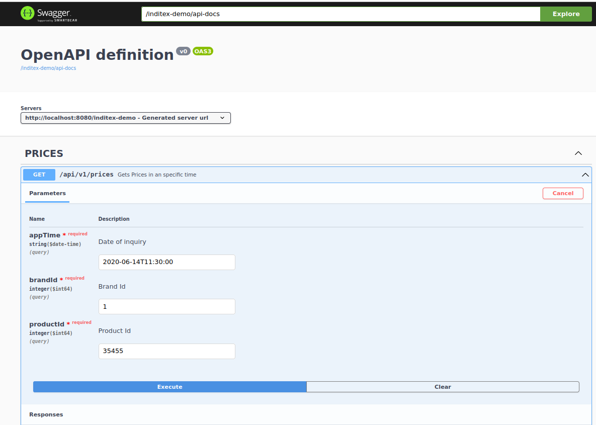

# Test para Inditex

## Resumen
Se trata de un pequeño microservicio para la consulta de Precios para una marca, producto y fecha determinados. Para ello se toma como base una tabla en una BBDD H2 en memoria autocargada en el arranque de la aplicación.

## Detalles
La aplicación esta desarrollada usando Java 17 + Spring como framework y usa un patrón MVC típico con:

  - Controller para la recepción de las peticiones. En ellos sólo se recibe la petición y se validan parámetros dejando la lógica de negocio para la capa Service.
  - Service para la ejecución de la lógica de negocio usando componentes Repository.
  - Repository como componente para la obtención de los datos solicitados.

## Tecnologías
Las tecnologías utilizadas son las siguientes:

  - Java 17
  - Spring Boot 3.0.4
  - Spring Data JPA 3.0.3
  - OpenAPI 3.0 usando la libreria springdoc-openapi v2.1.0
  - BBDD en memoria H2
  
## Ejecución
Se podrá ejecutar usando maven. Es necesario que en el entorno este configurado con JAVA_HOME java 17.

```cmd
mvn spring-boot:run
```

Igualmente se podrá ejecutar y debugear desde cualquier IDE (IntelliJ, STS, etc.)

Sobre el mismo se podrán lanzar peticiones usando el comando curl del siguiente modo:
 
```cmd
curl -X 'GET' 'http://localhost:8080/inditex-demo/api/v1/prices?appTime=22020-06-14T11%3A30%3A00&brandId=1&productId=35455' -H 'accept: application/json'
```
y se obtendrá un resultado como el siguiente:

```json
{
  "brandId": 1,
  "startDate": "2020-06-14T00:00:00",
  "endDate": "2020-12-31T23:59:59",
  "priceList": 1,
  "productId": 35455,
  "price": 35.5
}
```

Hay que tener en cuenta que los parámetros todos son obligatorios. Las fechas se podrán cambiar de acuerdo con los requerimientos de consulta y hay que tener en cuenta que el formato de fecha deberá atender al estándar ISO-8601

También se podrá usar la documentación generada con openAPI y accesible desde la url http://localhost:8080/inditex-demo/swagger-ui/index.html



## Revisión de Código
El presente microservicio esta construido siguiendo los principales patrones de diseño (Creational, Structural y Behavioral Patterns) y el Patróm MVC. En el se pueden observar los siguientes componentes principales.

### Controlador
Clase anotada con @RestController en la que se reciben las peticiones, se validan los parámetros se invoca la lógica de negocio implementada en un @Service y se devuelven los resultados en un objeto DTO.

 ```java
 
	@RestController
	@RequestMapping("/api/v1")
	@Validated
	@RequiredArgsConstructor
	public class PricesController {

	private final PricesService pricesService;

	private final PricesDtoMapper mapper;

    @Operation(summary = "Gets Prices in an specific time", description = "", tags = {"PRICES"})
    @RequestMapping(value = "/prices",
                    produces = MediaType.APPLICATION_JSON_VALUE,
                    method = RequestMethod.GET)
    @ApiResponse(responseCode = "200", description = "Getted Prices",
                 content = {@Content(mediaType = "application/json", schema = @Schema(implementation = PricesDto.class))})
    @ResponseStatus(value = HttpStatus.OK)
    public ResponseEntity<PricesDto> getPrices(
            @Parameter(name = "appTime", required = true, description = "Date of inquiry in format yyyy-MM-dd'T'HH:mm:ss.SSSXXX (2000-10-31T01:30:00.000-05:00)" )
            @RequestParam(value = "appTime", required = true) @DateTimeFormat(iso = DateTimeFormat.ISO.DATE_TIME) LocalDateTime appTime,
	        @Parameter(name = "brandId", required = true, description = "Brand Id" )
	        @RequestParam(value = "brandId", required = true) @Min(value = 1, message = "Must be a positive Integer") long brandId,
            @Parameter(name = "productId", required = true, description = "Product Id")
            @RequestParam(value = "productId", required = true) @Min(value = 1, message = "Must be a positive Integer") long productId)  {
	
```

Para el mapeo del objeto de salida se ha utilizado MapStruct el cual facilita en gran medida esta tarea.

### Service
Clase anotada con @Service en la que se invoca la lógica de negocio para lo cual se utliza un Repository

 ```java
 
	@Service
	@RequiredArgsConstructor
	@Slf4j
	public class PricesService { 
	
	private final PricesRepository pricesRepository;

    public Optional<PricesEntity> getPrices(LocalDateTime appTime, long brandId, long productId)  {
    	log.info("Starting Query... Parameters brandId {} productId {} appTime {}.", brandId, productId, appTime);
    	
		List<PricesEntity> pricesEntity = pricesRepository.getPrices(appTime, brandId, productId);
		
    	log.info("Ending Query...");
    	
    	return pricesEntity.stream().findFirst();
     }

```

Durante todo el desarrollo se utiliza lombok lo cual ayuda en gran medida para obtener Clean Code.

### Repository
Interfaz anotada con @Repository en la que se accede a la BBDD en memoria H2, la cual es creada y cargada con datos en el arranque usando las propiedades siguientes:

```property
database: h2
spring.sql.init.schema-locations: classpath*:db/${database}/schema.sql
spring.sql.init.data-locations: classpath*:db/${database}/data.sql
```

La interfaz utiliza un metodo @Query usando notación JPQL para obtener los datos deseados.

 ```java
 
	public interface PricesRepository extends JpaRepository<PricesEntity, PricesEntityId>{

	@Query("SELECT p FROM PricesEntity p WHERE p.brandId = :brandId AND p.startDate <= :appTime AND p.endDate > :appTime AND p.productId = :productId order by p.priority desc")
	List<PricesEntity> getPrices(@Param("appTime") LocalDateTime appTime, @Param("brandId") long brandId, @Param("productId") long productId);

	}

```


 
